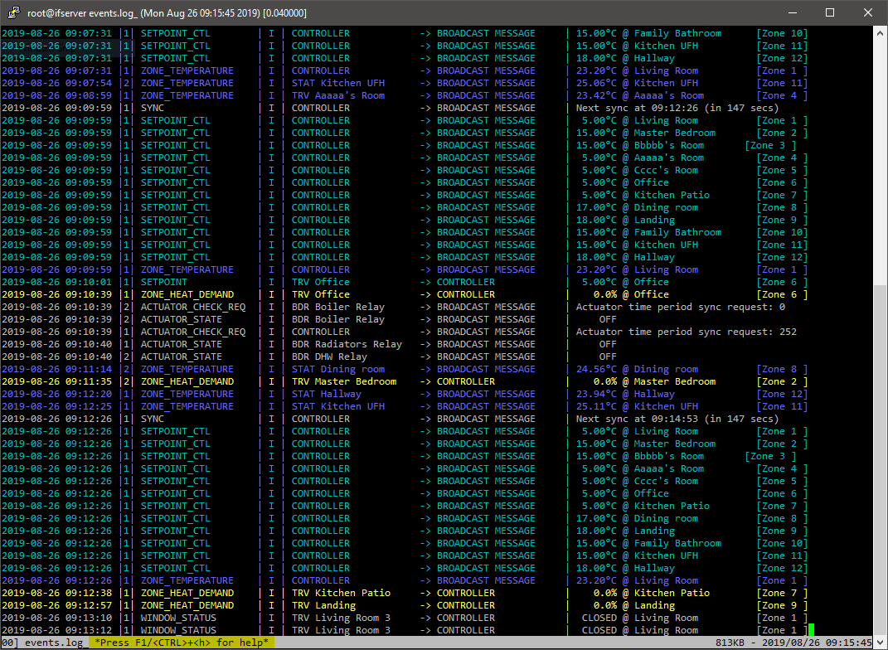
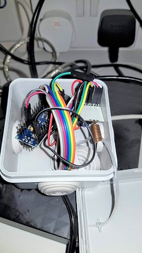

# Evohome Listener/Sender Gateway




***Update 28/08/19***: Added auto-retry for failed sending of commands; added send command status updates to mqtt topic; added custom send commands capability.

***Update 25/5/19***: "Sending" functionality added; some refactoring and bug fixes; README updated accordingly.

***Update 18/1/20***: Updated README to include HCC80R zone definition 

---

An evohome 'gateway' python script, for listening in on the radio communcation between Honeywell's evohome heating control devices, **and sending back** instructions to the Evohome Controller via the same radio mechanism. The hardware required for this script is is just (a) an arudino with a USB connector and (b) a CC1101 868Mhz radio receiver board (other hardware options also possible - see link in credits below).

In effect, with this script/hardware, one can have **local** control over evohome - e.g. with a home automation solution such as [openHAB](https://www.openhab.org/) - without needing to go via Honeywell's cloud API. 

## Listening to Evohome Messages 
Any device-to-device or broadcast message received via the radio hardware is decoded and then posted to:

1. A file containing just the 'event' messages (`EVENTS_FILE`)
2. A log file containing the undecoded messages (`LOG_FILE`)
3. An mqtt broker (if `MQTT_SERVER` is specified in the configuration file), to the topic specified in the config file (default  `evohome/gateway`).

## Sending Commands to the Evohome Controller
The gateway script subsribes to a defined mqtt topic (by default `evohome/gateway/command`). 

JSON messages to this topic are picked up by the script, processed and converted into the format required of evohome radio messages, and then transmitted. Currently, messages are only sent to the controller and not to any of the indvidual TRVs/other devices on the evohome network, with the intent that the controller will then treat these commands as valid instructions, and carry them out in its normal way. Towards this end, the gateway script pretends to be an Honeywell RG100 Remote Access Gateway, by using a device ID starting with "30:" (default ID unless specified in the config file is `30:071715`).

The format of the JSON command message is:
```json
{"command": "<COMMAND_NAME>", 
    "arguments" : 
        {"<ARG1_NAME>": <ARG1_VALUE>, "<ARG2_NAME>" : <ARG2_VALUE>}    
}
```
where <COMMAND_NAME> is one of:
* `ping` or `date_request`: This sends a datetime sync request to the controller, which responds back immediately. This command has no arguments.  
   
   e.g. `{"command":"ping"}`
* `controller_mode`: This is used to change the controller's mode. `ARG1_NAME` is `"mode"`, and `ARG1_VALUE` should be one of the following the mode numbers: 
  * 0: Auto
  * 1: Heating Off
  * 2: Eco-Auto
  * 3: Away
  * 4: Day Off
  * 7: Custom
 
   e.g. `{"command":"controller_mode", "arguments" : {"mode": 0}}`
* `setpoint_override`: This command can be used to change the setpoint of a given zone.  ARG1_NAME is `"setpoint"`, and its value `ARG1_VALUE` is a floating point number specifying the required temperature. `ARG2_NAME` of `"zone"` and `ARG2_VALUE` with the zone number must also be specified.  
 
   e.g. `{"command":"setpoint_override", "arguments" : {"setpoint": 5.0, "zone_id" : 5}}`
* `dhw_state`: This command is used to set the state of the hot water relay. `ARG1_NAME` is `"state_id"` with the corresponding value in `ARG1_VALUE`. Valid states are:
  * 0: Auto (i.e. on schedule)
  * 2: Permanent
  * 4: Temporary  
  
   e.g. `{"command":"dhw_state", "arguments" : {"state_id": 0}}`

Optionally, for a temporary change in mode, setpoint or dhw state, and end-time can be specified. For this, `ARG2_NAME` is `until` and `ARG2_VALUE` is the date/time in format `"YYYY-MM-DDTHH:MM:SSZ"`.  

An example of this command could be:  
  `{"command":"controller_mode", "arguments" : {"mode": 2, "until":"2019-05-21T03:30:00Z"}}`  
  
Finally, custom commands can be sent by providing the `command_code` in hex (with `0x` prefix) instead of `command` in the json, and the hex `payload` in the `arguments` json, e.g.:

`{"command_code": "0x313F"}`

Additionally, custom payloads can also be sent by adding to the `arguments` json. In this case, the `send_mode` must also be specified:

`{"command_code": "0x313F", "send_mode": "RQ", "arguments" : {"payload": "00"}}`

Finally, when such command instructions are received correctly by the controller, the controller responds back almost immediately with a message to the gateway. This is shown in the received messages window. The gateway system can automatically resend commands in case it has not received (or recognised) the command acknowledgement from the controller in a reasonable time. Timeouts between retries and maximum number of retries can be specified in the config file using the parameters `COMMAND_RESEND_TIMEOUT_SECS` and 
`COMMAND_RESEND_ATTEMPTS` respectively.

Note also that command send status, retries etc are posted to the MQTT broker, to a topic with the gateway's name.


### Requirements
This script has only been tested on Ubuntu 16.04 server, running python 2.7.12. It requires the following python modules:

1. pyserial - this can be installed with `python -m pip install pyserial`
2. paho mqtt - installed by `pip install paho-mqtt`

#### Script Configuration
Configuration parameters are defined in a separate file, `evogateway.cfg`, with the following format:

    [Serial Port]
    COM_PORT         = /dev/ttyUSB0
    COM_BAUD         = 115200
    COM_RETRY_LIMIT  = 10

    [Files]
    EVENTS_FILE      = events.log
    LOG_FILE         = evoGateway.log
    DEVICES_FILE     = devices.json
    NEW_DEVICES_FILE = devices_new.json   

    [MQTT]
    MQTT_SERVER      = 172.16.2.8
    MQTT_USER        = openhab
    MQTT_PW          = openhab
    MQTT_CLIENTID    = evoGateway
    MQTT_PUB_TOPIC   = evohome/gateway
    MQTT_SUB_TOPIC   = evohome/gateway/command

    [SENDER]
    THIS_GATEWAY_ID     = 30:071715
    THIS_GATEWAY_NAME   = EvoGateway
    COMMAND_RESEND_TIMEOUT_SECS = 30
    COMMAND_RESEND_ATTEMPTS = 5

    [MISC]
    LOG_DROPPED_PACKETS = False


#### Device Definitions
The `DEVICES_FILE` is a *json* file containing a list of the devices on the evohome network, based on their internal device IDs, e.g:

    {
        "01:139901": { "name" : "Living Room", "zoneId" : 1, "zoneMaster" : true }, 
        "04:000868": { "name" : "Bedroom 1", "zoneId" : 5, "zoneMaster" : true }, 
        "04:001048": { "name" : "Utility Room", "zoneId" : 9, "zoneMaster" : true },
        "07:033469": { "name" : "Wireless", "zoneId" : 0, "zoneMaster" : true }, 
        "13:102710": { "name" : "Heating", "zoneId" : 252, "zoneMaster" : true }, 
        "13:133904": { "name" : "DHW", "zoneId" : 0, "zoneMaster" : true }
    }

The deviceIDs are internal to each device. The first two digits determine the type of device (I think) and the remaining 6 digits are unique identifiers. As the listener script runs, if it finds a device with ID that has not been defined in the `DEVICES_FILE`, it will save it to a new file, as defined in the `NEW_DEVICES_FILE`. This can then be edited as required, and manually moved to replace the original `DEVICES_FILE`. 

The `name` parameter can be anything. Note that the script will automatically prefix a device type 3 or 4 letter acronym to the name in the various log files showing the device type (e.g. `TRV Master Bedroom`). The `zoneId` is the zone number that evohome has assigned, and the `zoneMaster` flag is used to identify which of the devices is the master, for controlling overall zone temperature, in an multi-device zone (e.g. where there are more than one TRVs in a given zone). 

*Note*: The HCC80R UFH relays seems to send it's own zone number (i.e. as per the lights on the HCC80R), independent of the zones defined in the main evohome controller. For example, if first zone on the HCC80R is for the dining room, the second for the kitchen etc, the HCC80R will send '0' for the dining room zone, '1' for kitchen etc. If for example, the dining room is mapped to Zone 8 on the main evohome controller, and the kitchen is mapped to zone 11, the parameter `ufh_zoneId` needs to be added, e.g:

    {
        "34:015243": { "name" : "Dining room", "zoneId": 8, "ufh_zoneId":0, "zoneMaster": true },
        "34:112193": { "name" : "Kitchen UFH", "zoneId": 11, "ufh_zoneId":1, "zoneMaster": true }
    }

#### Hardware
**NOTE** The hardware can be purchased **fully assembled**, including proper PCB, from ebay (search for `nanoCUL FTDI 868MHz`), and currently appears to be going for about £20. 

If building yourself, you will need:

* **1 x Arduino nano** (clone should be fine), preferably with FTDI usb chipset, though the cheaper CH341 chipset also worked. The only issue I had with the CH341 was that the USB port was not always cleanly released when the python script exited. My FTDI based build is much more reliable in this respect.

* **1 x CC1101 radio, 868MHz**, e.g. something like https://quadmeup.com/cc1101-868mhz-wireless-transciever-pinout 3. I think I paid about £2 for this. Also note that the image on that link does not show the antenna - this is just a small coil on mine (I’ve seen others with high gain antennaes but haven’t tried them as I wasn’t sure whether power directly from the arduino pins would be enough, and didn’t want to spend too much time on experimenting)

* **A breadboard** or **8 x Dupont fly leads**. If using fly leads you need to ensure that sure that you have the correct male/female combination for your arduino and CC1101 card.

The parts listed above can be purchased for about £6 from ebay/Ali Express etc.




Wiring pin connections will depend on the specific CC1101 board. In my case, I used the following:
```
WIRE COLOUR			CC1101 PIN 	NANO PIN
Red 				Vcc	        3.3V pin
Black 				GND 		GND
Orange 				MOSI		15
Yellow 				SCLK		17
Blue				MISO		16
Dark Red 			GDO2		32
Grey				GDO0 		1
White 				CSN 		14

ANT 				Antenna coil
```
The arduino nano I am using is an inexpensive clone with a CH341 usb chip (as compared to the normally recommended FTDI FT232L chipset), which has been working well. The C1101 radio board (868 Mhz) is also a cheap clone from China. In my case the radio board is connected directly to the nano using just male/female dupont wires, with the male side soldered directly onto the radio board. One point to keep in mind is ensuring that the pins used on the arduino are kept consistent with those defined in the respective hardware definition file for the firmware (e.g.  `hw/sha_nano_v3.h` if you are using a nano as well), or the firmware files updated accordingly. 

The firmware I am running is one modded by *ghoti57* available from https://github.com/ghoti57/evofw2, who had forked it from *codeaholics*, https://github.com/Evsdd, who in turn had forked it from *fulltalgoRythm's* orignal firmware, https://github.com/fullTalgoRythm/EvohomeWirelessFW. 

**NOTE:** In my case, "sending" would only work with the `fifo` branch of ghoti57's firmware. The master branch (as of 20/5/2019) worked with receiving messages, but I was unable to get it to work with sending messages - they just seemed to silently disappear!

#### Miscellaneous
As I use `multitail` for monitoring the event and log files from time to time, I have included a `multitail.conf` with colour options for highlighting specific message types.


### Credits
Code here is substantially based on the Domitcz source, specifically the `EvohomeRadio.cpp` file, by *fulltalgoRythm* - https://github.com/domoticz/domoticz/blob/development/hardware/EvohomeRadio.cpp. 

Also see http://www.automatedhome.co.uk/vbulletin/showthread.php?5085-My-HGI80-equivalent-Domoticz-setup-without-HGI80 for info and discussions on homebrew hardware options.


