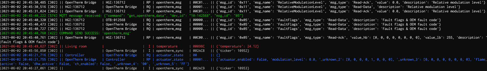

# evoGateway
An evohome to MQTT gateway
_______

[](evogateway_screenshot_v3.png)

_________________________


---

**Note** There has been a major rewrite of evoGateway (previously evoListener) as of May 2021, where the underlying underlying decoding (and encoding) of the evohome radio communications has been completely replaced using the excellent `ramses_rf` [framework library](https://github.com/zxdavb/ramses_rf). This has improved the robustness of the system and brought it up to date with some of the previously missing commands now being fully decoded. 

However, this has meant that there are **a number of breaking changes** within this version (currently version 3.0), for those coming from an earlier version. In many respects, it may be easier to start fresh with this version.

---

## What is it?
evoGateway is a 'gateway' python script that provides an MQTT interface for listening to and sending commands via the radio communcation network between Honeywell's evohome heating control devices. The hardware required for this script is is just (a) an arudino with a USB connector and (b) a CC1101 868Mhz radio receiver board (see below).

Any messages received by the radio is decoded and sent to an MQTT broker (copies are also saved to local log files). Additionally, the script subscribes to an MQTT topic for local user commands, which are appropriate encoded and sent out over the evohome radio network directly as if they orginated from a Honeywell evohome device. 

In effect, with this script/hardware, one can have **local** control over evohome - e.g. with a home automation solution such as [openHAB](https://www.openhab.org/) - without needing to go via Honeywell's cloud API. 


## Installation

The script requires python (preferabley version 3.8) and the following modules:

* colorama
* paho_MQTT
* ramses_rf

These can be installed by running ` pip install -r requirements.txt`).

Note that this script has only been tested on an Ubuntu 20.04 server running in a VM, with python 3.8.0. 


### Configuration
Configuration parameters are defined in a separate file, `evogateway.cfg`, with the format and parmaeters as given below. The only mandatory parameter is the `COM_PORT`. All others are optional (obviously without the MQTT broker details, nothing will be posted to an MQTT broker!):

    [Serial Port]
    # Serial port is mandatory
    COM_PORT         = /dev/ttyUSB0

    # Optional
    COM_BAUD         = 115200

    [Files]
    # The following are optional
    EVENTS_FILE                 = gw_events.log
    PACKET_LOG_FILE             = gw_packets.log
    DEVICES_FILE                = devices.json
    SCHEMA_FILE                 = ramses_rf_schema.json
    MAX_SAVE_FILE_COUNT         = 9

    [MQTT]
    MQTT_SERVER                 = x.x.x.x
    MQTT_USER                   = userid
    MQTT_PW                     = password

    MQTT_PUB_TOPIC              = evohome/evogateway
    MQTT_SUB_TOPIC              = evohome/evogateway/_zone_independent/command    
    MQTT_CLIENTID               = evoGateway

    #Publish as a single json string. If False, the key/values of the json will be published individually
    MQTT_PUB_AS_JSON            = False

    # Either group published messages by zone name (default), otherwise by device name
    MQTT_GROUP_BY_ZONE          = True

    [MISC]
    # optional
    THIS_GATEWAY_NAME           = evoGateway

    # Display full json string from evohome_rf, or just key data item for each row 
    DISPLAY_FULL_JSON            = False

## Using evoGateway

In contrast to earlier versions, the script is now almost fully automated in the way it discovers devices, and gets zone names directly from the controller etc (another of the benefits of the ramses_rf library!). 

The first time the script is run, it will run in the ramses_rf 'eavesdrop' mode, whereby it will attempt to listen in on the radio communications between the evohome devices  on the network, and build an internal schema of all the available devices, their types and parameters (e.g. zone names, valid temperature ranges etc). This should be left to run for a reasonable amount of time, to ensure that it has picked up communications from all the devices. Some devices, such as the DHW wireless sender, can in some instances take up to an hour before sending a message.

A list of currently found devices can be seen at any time by sending a `POST_SCHEMA` command (see below) to the subscribed MQTT channel. This will post the current 'schema', including a list of the devices and zones names detected so far etc, to the `evohome/evogateway/_zone_independent/_gateway_config` MQTT topic. On *exiting* the system, a copy of the internal schema is then saved to a file (default `ramses_rf_schema`), and loaded back during subsequent runs of the script. This file should not normally need to be manually edited (previous versions are overwritten with the current version). 

Additionally, a `devices.json` file is also saved. This file is a simple json dictionary of the device IDs detected along with a default device name based on its zone name (if the zone name is available at the time the file is saved). This file *can* be edited manually. Incorrect devices (i.e. those misinterpreted during the 'eavesdrop' or those from neighbours etc) should be removed. Device names can also be changed here and will be used for the MQTT topic instead of the device id. 

Note that the IDs in this `devices.json` forms the `allowed_list` - i.e. only messages from devices itemised in this file will be processed in future.

The devices (and schema) files can also be force saved at any time by sending the command `SAVE_SCHEMA`.

Similarly, eavesdropping mode can be re-initiated by deleting the `devices.json` and the `ramses_rf_schema` files.


### Sending Commands to the evohome Controller
The gateway script subsribes to a specific MQTT topic (by default `evohome/evogateway/_zone_independent/command`) for user commands to be sent out over the evohome radio network. 

JSON messages to this topic are picked up by the script, processed and converted into the format required by evohome, and then transmitted to the appropriate device. For this process, the gateway script in-effect pretends to be an Honeywell HGI80 device, with a device ID starting with `18:` (the ID is fixed in the arduino firware).

For users coming from earlier versions, it should be noted that the content of the JSON message to send commands has signficantly changed, to keep aligned with the underlying ramses_rf library. The new format of the JSON send command message is as follows:

```
{"command": "<command method>", "<keyword 1>" : "<keyword 1 value>", "<keyword 2>" : "<keyword 2 value>"...}
```

<command method> and the corresponding keyword parameters follow the ramses_rf command constructor methods (as defined within its [Command class](https://github.com/zxdavb/ramses_rf/blob/aa5f55ae63adb2750b783308a8690b82657a5f35/ramses_rf/command.py#L291)). As of the 20 May 2021, the following constructor methods are available, along with their respective list of keyword arguments (note that not all the arguments are mandatory):

```
Code 1F41, command method:  get_dhw_mode(ctl_id)
Code 0404, command method:  get_dhw_schedule_fragment(ctl_id, frag_idx, frag_cnt)
Code 3220, command method:  get_opentherm_data(dev_id, msg_id)
Code 0418, command method:  get_system_log_entry(ctl_id, log_idx)
Code 2E04, command method:  get_system_mode(ctl_id)
Code 313F, command method:  get_system_time(ctl_id)
Code 1100, command method:  get_tpi_params(ctl_id)
Code 000A, command method:  get_zone_config(ctl_id, zone_idx)
Code 2349, command method:  get_zone_mode(ctl_id, zone_idx)
Code 0004, command method:  get_zone_name(ctl_id, zone_idx)
Code 0404, command method:  get_zone_schedule_fragment(ctl_id, zone_idx, frag_idx, frag_cnt)
Code 1F41, command method:  set_dhw_mode(ctl_id, mode, active, until)
Code 10A0, command method:  set_dhw_params(ctl_id, setpoint, overrun, differential)
Code 1030, command method:  set_mix_valve_params(ctl_id, zone_idx, max_flow_setpoint, min_flow_setpoint, valve_run_time, pump_run_time)
Code 2E04, command method:  set_system_mode(ctl_id, system_mode, until)
Code 313F, command method:  set_system_time(ctl_id, datetime)
Code 1100, command method:  set_tpi_params(ctl_id, domain_id, cycle_rate, min_on_time, min_off_time, proportional_band_width)
Code 000A, command method:  set_zone_config(ctl_id, zone_idx, min_temp, max_temp, local_override, openwindow_function, multiroom_mode)
Code 2349, command method:  set_zone_mode(ctl_id, zone_idx, mode, setpoint, until)
Code 0004, command method:  set_zone_name(ctl_id, zone_idx, name)
Code 2309, command method:  set_zone_setpoint(ctl_id, zone_idx, setpoint)
```

The controller ID keyword `ctl_id` is optional and if not provided in the JSON message, will default to the internal one (i.e. from the eavesdropped schema). 

An example JSON MQTT message for getting the first system log entry from the Controller would thus be:

```json
{"command" : "get_system_log_entry", "log_idx": 0}

```

Date/time values should be sent in the in the usual iso format, e.g. to turn the hot water one until 17:40 on 31st May 2021:

```json
{"command" : "set_dhw_mode", "active": true, "until" : "2021-05-31T17:40:00"}
```

In addition to using the built-in ramses_rf command constructors, a command `code` can still be sent but again the message structure has been changed to keep aligned with the ramses_rf framework. When sending a command `code`, both `verb` and `payload` must also be included, where `verb` is usually RQ, RP, W etc. and `payload` is the **hex** payload that for the given command code. Optionally `dest_id` may be specified with the ID of the recipient device, if the command is not being sent to the controller (default).

An equivalent example for getting the 1st system log entry but using the command code would be:

```json
{"code" : "0418", "verb": "RQ", "payload": "000000"}
```

Status updates for commands sent via the evohome network are posted to the topic `evohome/evogateway/_zone_independent/command/_last_command/status`. 

Finally, there are a few 'system' commands available for use whilst evoGateway is running. These are called by sending `sys_config` values (instead of the previous `command` and `code`). Currently available commands are:
* POST_SCHEMA - this posts the current  schema, devices etc etc
* SAVE_SCHEMA - this posts the current  schema, devices etc etc, AND saves them to files
* DISPLAY_FULL_JSON  - switches between the 'simple' display of evoGateway versus the detailed json output from ramses_rf. Note that this is for onscreen display only; log files still contain the full json data.


## Hardware
**NOTE** The hardware can be purchased fully assembled, including proper PCB, from ebay (search for `nanoCUL FTDI 868MHz`), or in component form from ebay/Ali Express etc.

If assembling yourself, you will need:

* **1 x Arduino nano** (clone should be fine), preferably with FTDI usb chipset, though the cheaper CH341 chipset also worked. The only issue I had with the CH341 was that the USB port was not always cleanly released when the python script exited. My FTDI based build is much more reliable in this respect.

* **1 x CC1101 radio, 868MHz**, e.g. something like [this](https://quadmeup.com/cc1101-868mhz-wireless-transciever-pinout). However, note that there has been some report of issues with the radio crystal's accuracy on some of these boards ([discussion on evofw3 board](https://github.com/ghoti57/evofw3/issues/11#issuecomment-823484744)).

* **A breadboard** or **8 x Dupont fly leads**. If using fly leads you need to ensure that sure that you have the correct male/female combination for your arduino and CC1101 card.


Wiring pin connections will depend on the specific CC1101 board. In my case, I used the following:
```
WIRE COLOUR			CC1101 PIN 	NANO PIN
Red 				Vcc	        3.3V pin
Black 				GND 		GND
Orange 				MOSI		15
Yellow 				SCLK		17
Blue				MISO		16
Dark Red 			GDO2		32
Grey				GDO0 		1
White 				CSN 		14

ANT 				Antenna coil
```

Although arduinos with the FTDI FT232L chipset are recommended, clone nanos with the CH341 usb chip have also worked reasonably. In my case the radio board is connected directly to the nano using just male/female dupont wires, with the male side soldered directly onto the radio board. Note that actual pin connection points should always follow the requirements of evofw3 (e.g. see the [atm328_pins.h](https://github.com/ghoti57/evofw3/blob/36b7a9ca1d97fc0f81ffaea1e8e8b3c780024cd6/atm328_pins.h) file), otherwise corresponding changes may need to be made in in this file before compiling and flashing the firmware.

### Arduino Firmware
evoGateway requires the **[evofw3](https://github.com/ghoti57/evofw3)** arduino firmware by @ghoti57, to decode/encode the radio signals and make the message packets available to/from the ramses_rf framework. 


### Credits
evoGateway is based substantially around the `ramses_rf` python framework library written and maintained by David Bonnes (@zxdavb) - https://github.com/zxdavb/ramses_rf, and of course credit to Peter Price (@ghoti57) for his **[evofw3](https://github.com/ghoti57/evofw3)** firmware for the arduinio, without which none of this would be possible!

(Older pre-version 3 of this script was based on the Domitcz source, specifically the `evohomeRadio.cpp` file, by *fulltalgoRythm* - https://github.com/domoticz/domoticz/blob/development/hardware/evohomeRadio.cpp). 

Also see http://www.automatedhome.co.uk/vbulletin/showthread.php?5085-My-HGI80-equivalent-Domoticz-setup-without-HGI80 for info and discussions on homebrew hardware options.


## Pre-Version 3 History

**Update 28/08/2019** Added auto-retry for failed sending of commands; added send command status updates to MQTT topic; added custom send commands capability.

**Update 25/5/2019** "Sending" functionality added; some refactoring and bug fixes; README updated accordingly.

**Update 18/1/2020** Updated README to include HCC80R zone definition 

**Update 25/2/2020** Added OpenTherm decoding

**Update 03/3/2020** Added decoding of controller fault log messages (note `device_info` has been changed to `fault_log`)
                     Added support for overriding sent message acknowledgements

**Update 06/4/2020** Added support for newer firmwares, such as evofw3, which include RSSI

**Update 09/6/2020** BREAKING CHANGE - Migrated to python 3 (as python 2 is EOL)

**Update 18/10/2020** Fix "zoneId" error. Merge enhancements by @number42net (MQTT reconnect, UTC datetime)


