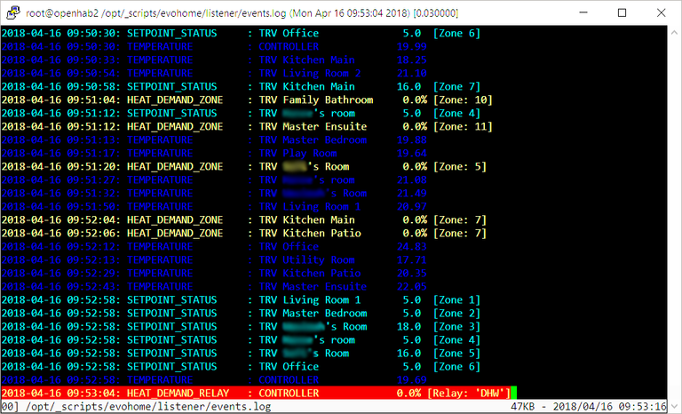

# Evohome Listener

A simple evohome 'listener' python script, for listening in on the radio messages between Honeywell's evohome heating control devices using an arudino with a CC1101 868Mhz radio receiver board (other hardware options also possible - see link in credits below). Messages are interpreted and then posted to:

1. A file containing just the 'event' messages (`EVENTS_FILE`)
1. A log file containing the undecoded messages (`LOG_FILE`)
1. An mqtt broker if `MQTT_SERVER` is specified in the configuration file.

### Requirements
This script has only been tested on Ubuntu 16.04 server, running python 2.7.12. It requires the following python modules:

1. pyserial - this can be installed with `python -m pip install pyserial`
1. paho mqtt - installed by `pip install paho-mqtt`

#### Script Configuration
Configuration parameters are defined in a separate file, `evolistener.cfg`, with the following format:

    [Serial Port]
    COM_PORT         = /dev/ttyUSB0
    COM_BAUD         = 115200
    COM_RETRY_LIMIT  = 10

    [Files]
    EVENTS_FILE      = events.log
    LOG_FILE         = evolistener.log
    DEVICES_FILE     = devices.json
    NEW_DEVICES_FILE = devices_new.json   

    [MQTT]
    MQTT_SERVER      = 172.16.2.8
    MQTT_THREAD      = evohome/listener/
    MQTT_USER        = openhab
    MQTT_PW          = openhab
    MQTT_CLIENTID    = evoListener

#### Device Definitions
The `DEVICES_FILE` is a *json* file containing a list of the devices on the evohome network, based on their internal device IDs, e.g:

    {
        "01:139901": { "name" : "CTL Living Room", "zoneId" : 1, "zoneMaster" : true }, 
        "04:000868": { "name" : "TRV Bedroom 1", "zoneId" : 5, "zoneMaster" : true }, 
        "04:001048": { "name" : "TRV Utility Room", "zoneId" : 9, "zoneMaster" : true },
        "07:033469": { "name" : "DHW Wireless", "zoneId" : 0, "zoneMaster" : true }, 
        "13:102710": { "name" : "RLY Heating", "zoneId" : 252, "zoneMaster" : true }, 
        "13:133904": { "name" : "RLY DHW", "zoneId" : 0, "zoneMaster" : true }
    }

The deviceIDs are internal to each device. The first two digits determine the type of device (I think) and the remaining 6 digits are unique identifiers. As the listener script runs, if it finds a device with ID that has not been defined in the `DEVICES_FILE`, it will save it to a new file, as defined in the `NEW_DEVICES_FILE`. This can then be edited as required, and manually moved to replace the original `DEVICES_FILE`. 

The `name` parameter can be anything, just to help make identifying easier. In the example above, a 3 letter prefix is used to easily identify the type of device (though this is not required). The `zoneId` is the zone number that evohome has assigned, and the `zoneMaster` flag is used to identify which of the devices is the master, for controlling overall zone temperature, in an multi-device zone (e.g. where there are more than one TRVs in a given zone). 

#### Hardware
The arduino nano I am using is an inexpensive clone with a CH341 usb chip (as compared to the normally recommended FTDI FT232L chipset), which has been working well. The C1101 radio board (868 Mhz) is also a cheap clone from China. In my case the radio board is connected directly to the nano using just male/female dupont wires, with the male side soldered directly onto the radio board. One point to keep in mind is ensuring that the pins used on the arduino are kept consistent with those defined in the respective hardware definition file for the firmware (e.g.  `hw/sha_nano_v3.h` if you are using a nano as well), or the firmware files updated accordingly. 

The firmware I am running is one modded by *ghoti57* available from https://github.com/ghoti57/evofw2, who had forked it from *codeaholics*, https://github.com/Evsdd, who in turn had forked it from *fulltalgoRythm's* orignal firmware, https://github.com/fullTalgoRythm/EvohomeWirelessFW. 

#### Miscellaneous
As I use `multitail` for monitoring the event and log files from time to time, I have included a `multitail.conf` with colour options for highlighting specific message types.

### Credits
Code here is substantially based on the Domitcz source, specifically the `EvohomeRadio.cpp` file, by *fulltalgoRythm* - https://github.com/domoticz/domoticz/blob/development/hardware/EvohomeRadio.cpp. 

Also see http://www.automatedhome.co.uk/vbulletin/showthread.php?5085-My-HGI80-equivalent-Domoticz-setup-without-HGI80 for info and discussions on homebrew hardware options.

