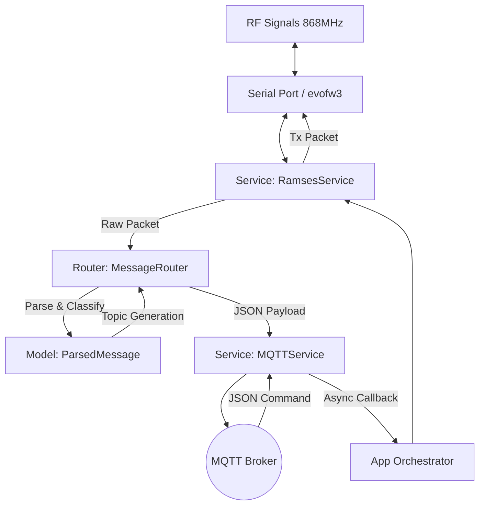
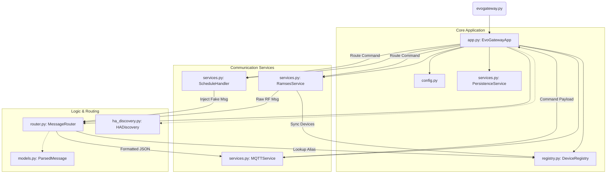
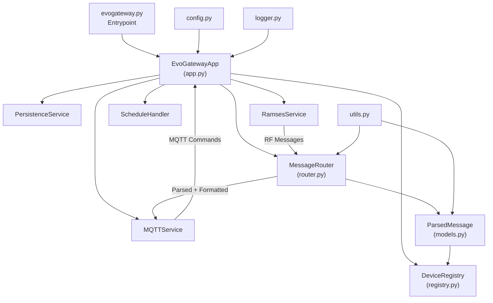
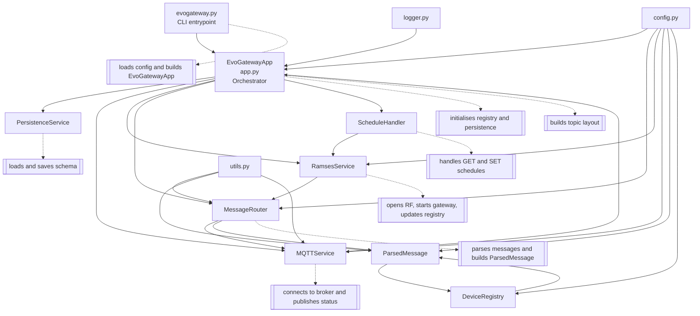

<span style="font-size: 0.8em;">*This document is intended as a quick reference and reminder for me, of how everything links together, to make the system easier to maintain and update in the future. 

It was entirely generated by Gemini 3.0 and ChatGPT 5.1, by just uploading the source files into each of them! They both produced similar but slightly different outputs, and I have merged below the better/more relevant parts from each.*</span>

-----

# evoGateway: Project Reference Guide

## 1. Top-Level Overview

The evoGateway project provides a local, cloud‑independent bridge between the Honeywell evohome RF ecosystem and MQTT. It listens to RF traffic (via `ramses_rf`), decodes messages, enriches them with metadata, and publishes structured MQTT topics. It also listens for MQTT commands and sends valid RF commands back onto the network.

At runtime, the system consists of:

* A **main entrypoint** (`evogateway.py`).
* The **EvoGatewayApp** orchestrator (`evogateway/app.py`).
* A set of **services** handling MQTT, Ramses RF messaging, persistence, and schedules (`services.py`).
* A **router** that formats, categorises, and republishes messages (`router.py`).
* A **registry** maintaining aliases, zones, types, and UFH mappings (`registry.py`).
* **Models** describing parsed messages and classification rules (`models.py`).
* **Utilities** for formatting, printing, snake_case, JSON cleaning (`utils.py`).
* **Configuration classes and constants** (`config.py`).
* **Logging helpers** (`logger.py`).

All system behaviour is configured from `config/evogateway.cfg` and the ramses RF schema file.

-----

## 2\. System Architecture & Data Flow

### Data Flow Diagram



### Inter-Module Dependency Diagram

This diagram shows how the "Orchestrator" (`app.py`) initializes services and how data flows between them.


-----


## 3\. Module Reference
### 📂 `evogateway.py` (Entry Point)

**Purpose:** The bootstrap script. It handles command-line arguments and launches the main asyncio event loop.

  * `main()`: Parses CLI args (`--config`) and runs the async entry point.
  * `_main_async(config_path)`: Loads configuration and starts `EvoGatewayApp`.

### Key Flow

1. Parse `--config` argument.
2. Load AppConfig via `AppConfig.load()`.
3. Initialise app: `app = EvoGatewayApp(cfg)`.
4. `await app.run()`.

### Links To Other Modules

* Uses `AppConfig` from `config.py`.
* Uses `EvoGatewayApp` as the main orchestrator.

-----

### 📂 `evogateway/app.py` (The Orchestrator)

  * **Purpose:** The central hub. It initializes all other components, injects dependencies, and manages the application lifecycle (startup/shutdown).
  * **Key Class:** `EvoGatewayApp`
  * **Responsibilities:**
      * Loads Config (`config.py`) and Logger (`logger.py`).
      * Instantiates and links:
        * `DeviceRegistry`
        * `PersistenceService`
        * `MQTTService`
        * `RamsesService`
        * `MessageRouter`
        * `ScheduleHandler`
      * Connects the "pipes" (e.g., tells `RamsesService` to send messages to `Router.handle_message`).
      * Runs the main `asyncio` loop.
      * Handles graceful shutdown (saving schemas, disconnecting MQTT).
      * Handle inbound MQTT commands.
      * Publish schema snapshots.

| Class / Function | Description |
| :--- | :--- |
| **`class EvoGatewayApp`** | **The Main Application Class.** |
| `__init__` | Initializes Logger, Registry, Persistence, MQTT, and Router. |
| `_build_ramses_config` | Prepares configuration for the `ramses_rf` library (loads schema if exists). |
| `run` | **Main Loop.** Starts MQTT, Router, Ramses services, and keeps the app alive. |
| `shutdown` | Gracefully stops services and saves the schema. |
| `_on_mqtt_message` | Callback for inbound MQTT messages. Gateway management commands (`RESTART_*`) are not executed if the message is retained — the retained message is auto-cleared from the broker and a warning is logged. Routes other commands to `ScheduleHandler` or `RamsesService`. |
| `_publish_command_status` | Publishes ACK/NACK status of commands back to MQTT. |
| `_publish_schema_snapshot` | Publishes the full system state (schema, devices, params) to MQTT. |
| `_print_gateway_schema` | Prints the current schema to the console (for debugging/shutdown). |
| `current_schema_snapshot` | Returns the current schema as a dict. |
| `_handle_sys_config` | Handles system commands like `SAVE_SCHEMA`. |


### Key Linkages

* Depends on: `config`, `router`, `services`, `registry`, `utils`, `logger`.
* Every major component is owned and managed by EvoGatewayApp.

---
### 📂 `evogateway/services.py` (The Workers)

Contains four distinct service classes that handle the "heavy lifting."

#### 1\. `class MQTTService`: 
Wrapper around `paho-mqtt` in a thread-safe way. Runs on its own thread but bridges messages back to the main `asyncio` loop.

  * `start()`: Connects to the broker and starts the loop.
  * `stop()`: Disconnects gracefully.
  * `publish(subtopic, payload)`: Helper to publish JSON data.
  * `publish_status(status)`: Publishes Online/Offline LWT status.
  * `_on_connect` / `_on_disconnect`: Connection event handlers.
  * `_on_message`: Receives raw MQTT bytes, decodes to JSON, calls the async callback.

#### 2\. `class RamsesService`
The wrapper for the external `ramses_rf` library. It manages the connection, discovery, receiving messages and sending commands (`_send_cmd`).

  * `start()`: Initializes `ramses_rf.Gateway`, setups the initial parameters forthe gateway, enables discovery if required, and syncs the registry.
  * `process_command(payload)`: Entry point for executing commands (validates inputs).
  * `_send_cmd(gw_cmd, ...)`: Physically transmits the packet via `ramses_rf`.
  * `_handle_gwy_message(msg)`: **Critical.** The callback fired by `ramses_rf` for every RF packet. Passes it to `MessageRouter`.
  * `sync_registry_from_gwy()`: Scrapes `ramses_rf` internal state to update `DeviceRegistry`.
  * `_refresh_devices` / `_refresh_zones`: Internal helpers to keep local state in sync with the library.
  * `_load_ufh_mapping_from_schema`: Special handling for UFH circuit mapping.

#### 3\. `class ScheduleHandler`
Logic for `get_schedule` and `set_schedule` via `ramses_tx` commands.

  * `handle_command(payload)`: Switch statement for `get_schedule` vs `set_schedule`.
  * `get_schedule(zone_idx)`: Requests schedule from controller, waits, then publishes result.
  * `set_schedule(zone_idx, schedule)`: Pushes new schedule to the controller.
  * `_publish_schedule_for_zone`: Creates a "Fake" RAMSES message containing the schedule data so `MessageRouter` treats it like a normal incoming packet for displaying and logging.

#### 4\. `class PersistenceService`
Manages file I/O for `ramses_rf_schema.json`. Handles file rotation (backups `.1`, `.2`, etc.).

  * `load_schema()`: Reads `ramses_rf_schema.json`.
  * `save_schema(data)`: Writes the schema to disk.
  * `save_json_with_rotation`: Handles file versioning (e.g., `.1`, `.2`).

---

### 📂 `evogateway/router.py` (The Translator)

  * **Purpose:** Takes raw data, makes it pretty, and pushes it out.
  * **Key Class:** `MessageRouter`
  * **Responsibilities:**
      * **Parsing:** Calls `parse_message` to create a `ParsedMessage` object.
      * **Console Output:** Formats the colorful text rows you see in the terminal (`format_simple_row`).
      * **Dispatch:** Uses `family_handlers` (e.g., `handle_temperature`, `handle_fault`) to decide how to process specific message types.
      * **Publishing:** Calls `_publish_received_payload` to send data to MQTT.

### Key Features

  * **Display formatting** (simple row, metadata columns).
  * **MQTT publishing**:

    * JSON-only.
    * JSON+KV.
    * Timestamp topics.
  * **Topic mapping logic** that respects:

    * zones
    * controllers
    * relays
    * UFH
    * legacy vs new structure
    
  | Class / Function | Description |
  | :--- | :--- |
  | **`class MessageRouter`** | **Manages presentation and publishing.** |
  | `handle_message(msg)` | **Entry Point.** Receives raw msg, logs it, parses it, and dispatches it. |
  | `parse_message(msg, item)` | Converts raw packet + payload item into a `ParsedMessage` object. |
  | `_publish_received_payload` | Takes a `ParsedMessage`, determines the MQTT topic, and publishes. Also triggers `_update_and_publish_state`. |
  | `_update_and_publish_state` | Maintains per-zone and system state caches; publishes aggregated `zones/<zone>/state` and `system/state` topics consumed by HA discovery. |
  | `family_handlers` | Dictionary mapping message families (e.g., 'temperature') to specific methods. |
  | `handle_temperature`, `handle_fault`, etc. | Specific logic for handling different message types. |
  | `format_simple_row` | Formats the one-line console log output. |
  | `display_device_list` | Prints the startup "Devices from schema" table. |


### How It Links

* Uses registry for metadata.
* Uses MqttConfig.TopicLayout from config.
* Uses utils formatting functions.
* All inbound RF messages flow through Router.
-----


### 📂 `evogateway/models.py` (The Data Structure)

  * **Purpose:** Provide a unified `ParsedMessage` model representing a normalised evohome message.
  * **Key Class:** `ParsedMessage` (Dataclass)
  * **Why it is critical:**
      * It normalizes data (resolves `zone_id` from `zone_idx` or `domain_id`).
      * It contains the **Topic Generation Logic** (`topic_base`). If you want to change how MQTT topics look (e.g., change `/status` to `/state`), you edit it here.
      * It classifies messages (e.g., `is_fault`, `is_temperature`).

### Responsibilities

  * Extract common fields (src_id, dst_id, code, verb, rssi, timestamp).
  * Resolve logical zone using registry and payload hints.
  * Provide classification helpers:

    * `is_temperature`, `is_demand`, `is_device_info`, etc.
    * `family` → used by router to dispatch handlers.
  * Provide MQTT topic helpers:

    * `topic_device()`
    * `topic_zone()`
    * `topic_code()`
    * `topic_base()` (full topic resolution logic)


| Class / Function | Description |
| :--- | :--- |
| **`class ParsedMessage`** | **Immutable Data Class for processed messages.** |
| `__post_init__` | Auto-calculates `zone_name` and `zone_id` upon creation. |
| `_resolve_zone_id` | Complex logic to determine which zone a message belongs to (handles Relays, UFH, etc.). |
| `topic_base` | **Critical.** Generates the MQTT topic string (e.g., `evogateway/zones/kitchen/temperature`). |
| Properties (`is_fault`, `is_temperature`) | Boolean helpers for classification. |
| `src_alias`, `dst_alias` | Helpers to get friendly names from the Registry. |

-----

### 📂 `evogateway/registry.py` (The Phonebook)

  * **Purpose:** Acts as the unified metadata store for all device‑related lookups.
  * **Key Class:** `DeviceRegistry`
  * **Responsibilities:**     
      * Maintain:

        * Device aliases.
        * Device types.
        * Zone assignments.
        * Zone names.
        * UFH (under‑floor heating) circuit → zone mappings.
        * HGI identity and friendly gateway name.

      * Merges data from the stored schema *and* live discovery.

| Class / Function | Description |
| :--- | :--- |
| **`class DeviceRegistry`** | **Store for aliases and topology.** |
| `alias_of(dev_id)` | Returns friendly name (or generates a fallback like "TRV (12:34)"). |
| `zone_name(zone_id)` | Returns "Kitchen" for zone "01". |
| `zone_of(dev_id)` | Returns the zone index a device belongs to. |
| `ufh_zone_for` | Maps UFH Controller + Circuit ID -\> Zone Index. |
| `load_from_schema` | Populates initial state from the JSON file. |
| `update_alias`, `update_zone` | Methods for live updates during discovery. |
| Various | Update methods used by RamsesService during discovery.|

### How It Links

* **Router** uses registry to resolve names for display and MQTT.
* **ParsedMessage** uses registry to derive zone name, id, and type.
* **RamsesService** populates and syncs this registry.

---

### 📂 `evogateway/config.py` (The Settings)

  * **Purpose:** Defines structured configuration for all aspects of evoGateway.
  * **Components:**

      * **FilesConfig**: event logs, schema file, backup behaviour.
      * **SerialConfig**: port + baud for the Arduino/evofw3 radio.
      * **MqttConfig**: broker address, credentials, topic layout, JSON/KV behaviour.

        * Builds a full **TopicLayout** object used everywhere.
      * **RamsesConfig**: discovery/eavesdrop/sending settings.
      * **WatchdogConfig**: heartbeat/watchdog loop settings — `WATCHDOG_CHECK_INTERVAL` (poll frequency, default 60 s; `0` disables everything), `MQTT_HEARTBEAT_INTERVAL`, and the four RF silence thresholds (`RF_WARN_TIMEOUT`, `RF_RESTART_TIMEOUT`, `RF_PROCESS_RESTART_TIMEOUT`, `RF_EXIT_TIMEOUT`). All RF thresholds are accurate to ±`WATCHDOG_CHECK_INTERVAL`.
      * **MiscConfig**: output formatting, colours, gateway name.
      * **AppConfig**: master object combining all config sections.

| Class / Function | Description |
| :--- | :--- |
| **`class AppConfig`** | Top-level config container. |
| **`class MqttConfig`** | specific MQTT settings. |
| `MqttConfig.build_topic_layout` | **Critical.** Defines the folder structure for MQTT topics (Legacy vs New). |
| `AppConfig.load(path)` | Static factory method to read the `.cfg` file. |

### How It Links

* EvoGatewayApp loads all configuration here.
* Router, services, registry all rely on MqttConfig, colours, and flags.

---

### 📂 `evogateway/ha_discovery.py` (Home Assistant Integration)

  * **Purpose:** Generates and publishes Home Assistant MQTT discovery payloads at startup and on every MQTT reconnect.
  * **Key Class:** `HADiscovery`
  * **Enabled by:** `HA_DISCOVERY_ENABLED = True` in `evogateway.cfg`
  * **Discovery format:** HA device-mode — one retained topic per logical device (`homeassistant/device/{device_id}/config`), all entities bundled under `components`.

| Class / Function | Description |
| :--- | :--- |
| **`class HADiscovery`** | **HA MQTT discovery publisher.** |
| `publish_all()` | Entry point. Resolves controller slug once, then calls the four device publishers for all zones and physical devices. Excludes DHW BDR91 relay from the generic device loop (handled inside `_publish_dhw_device`). Called at startup and on MQTT reconnect. |
| `remove_all()` | Removes all HA discovery entries (both legacy `+/+/config` and device-mode `device/+/config`) by publishing empty retained payloads. Triggered by `REMOVE_HA_DISCOVERY` sys_config command. |
| `_publish_gateway_device` | Gateway device: system mode `select` + DHW/Radiators/UFH relay demand `sensor` components (reads from `system/controllers/{ctl}/relay_demand/_domain_*` topics). |
| `_publish_zone_device` | Zone device: `climate` (temp + setpoint from controller topics) + heat demand `sensor`. |
| `_publish_dhw_device` | DHW device: `climate` (heat/auto/off) + relay active `binary_sensor` (from `bdr_dhw_relay/actuator_state`) + DHW sender battery `sensor`. Resolves sensor, controller, and DHW relay slugs from registry; overridable via config. |
| `_publish_physical_device` | Physical device (TRV, relay, etc.): all sensors from `DEVICE_SENSORS`, named `"{Zone} {Type} ({alias})"`, parented to zone via `via_device`. System relay devices (types 02, 10, 13) use `system/relays/{slug}/` topic path. |
| `_find_dhw_relay_slug` | Helper: finds the BDR91 relay in the DHW zone (zone HW or F9) and returns its snake_case slug. |
| `DEVICE_SENSORS` | Dict mapping device type codes → sensor descriptors with `msg_code` (MQTT topic sub-path, may include `/` for nested paths like `opentherm_msg/boilerwatertemperature`) and `field` (JSON payload key). Multiple entries with the same `msg_code` but different `field` are allowed (e.g. OTB `actuator_state` produces four separate entities). Edit here to add/rename sensors. |

### How It Links

* Instantiated by `app.py` after startup if `ha_discovery_enabled` is set.
* Reads zone and device metadata from `DeviceRegistry`.
* Uses `MQTTService.publish(raw=True)` to publish to full `homeassistant/…` topics without root_topic prefix.
* Zone climate entities read from controller-reported per-zone topics; zone state (`zones/<zone>/state`) is still written by `MessageRouter._update_and_publish_state` and used by heat demand sensors.
* `MQTTService._on_connect_extra` hook calls `publish_all()` on reconnect.

---

### 📂 `evogateway/utils.py` (Helpers)

  * **Purpose:** Common helper functions for formatting and string manipulation, used throughout

### Key Functions

* `to_snake_case()` – for topic paths.
* `truncate()` – console formatting.
* `print_formatted_row()` – aligned console output.
* `clean_display_text()` – readable payload formatting.
* `zone_group()` – zone classification.
* `mqtt_safe_value()` – sanitises values for MQTT.

### How It Links

* Router uses nearly all of these functions.
* Console output depends heavily on this module.
  
### 📂 `evogateway/logger.py`
  * **Purpose:** Configure log rotation + optional coloured console logs.

  * **Responsibilities**

      * Create rotating file handler.
      * Create colourised console handler.
      * Return application logger.

### How It Links
* EvoGatewayApp constructs logger at startup.
* Services log to this unified logger.


-----

## 4\. Key Data Structures

### The `ParsedMessage` Object

When a packet arrives, it is converted into this object (in `models.py`). This is the most important object to understand if you are debugging MQTT topics.

```python
@dataclass(frozen=True)
class ParsedMessage:
    raw: Any                  # Original ramses_rf packet
    payload: Dict[str, Any]   # The clean data dictionary
    verb: str                 # I, RQ, RP, W
    code: str                 # e.g., "temperature", "setpoint"
    zone_id: str              # "01", "02", "HW" (Resolved!)
    zone_name: str            # "Living Room" (Resolved!)
    ...
```

## 5\. Data Flow Scenarios

### RF → MQTT Path

1. **RamsesService** receives raw RF packet.
2. It extracts metadata + payload.
3. It calls router with (msg, payload).
4. **MessageRouter** → produces a ParsedMessage.
5. Router formats console output.
6. Router publishes structured MQTT payload + KV values.

### MQTT → RF Path

1. MQTTService receives JSON on command topic.
2. App’s `_on_mqtt_message` determines if schedule or command.
3. Commands are passed to RamsesService.
4. RamsesService builds ramses_tx command.
5. Sends onto RF network via Gateway.

### Schema Lifecycle

* Loaded at startup (if exists).
* Populated during discovery.
* Periodically published to MQTT.
* Saved via command or at shutdown.

### Example Scenario A: Incoming Temperature Reading

1.  **RF:** `04:123456` sends `30C9` (Temperature) packet.
2.  **RamsesService:** Receives packet via `_handle_gwy_message`.
3.  **Router:** `handle_message` calls `parse_message`.
4.  **Model:** `ParsedMessage` uses `Registry` to find that `04:123456` is "Bedroom Sensor" in Zone "Bedroom".
5.  **Router:** `_publish_received_payload` asks `ParsedMessage` for the topic.
      * Topic: `evogateway/zones/bedroom/bedroom_sensor/temperature`
6.  **MQTT:** `MQTTService` publishes JSON payload to broker.

### Example Scenario B: Outbound "Set Temperature" Command

1.  **MQTT:** User publishes JSON to `evogateway/system/_command`:
      * `{"command": "set_zone_setpoint", "zone_idx": "01", "setpoint": 21.0}`
2.  **App:** `_on_mqtt_message` sees the command.
3.  **RamsesService:** `process_command` validates it against `ramses_rf.Command` library.
4.  **RamsesService:** `_send_cmd` transmits bytes via Serial Port.
5.  **Status:** App publishes "Transmitted" to MQTT status topic.

-----


## 6. Summary: What Each File Does

| File               | Purpose                                                           |
| ------------------ | ----------------------------------------------------------------- |
| `evogateway.py`    | Main CLI entrypoint; loads config and runs app.                   |
| `app.py`           | Orchestration, dependency injection, lifecycle management.        |
| `config.py`        | All configuration structures + constants + topic layout.          |
| `registry.py`      | Device metadata source of truth (aliases, zones, UFH).            |
| `router.py`        | Formats + routes messages, publishes MQTT output, zone state agg. |
| `services.py`      | MQTTService, RamsesService, PersistenceService, ScheduleHandler.  |
| `models.py`        | ParsedMessage model, message classification + MQTT topic helpers. |
| `ha_discovery.py`  | Home Assistant MQTT discovery publisher.                          |
| `utils.py`         | String/JSON formatting, printing, snake_case, helpers.            |
| `logger.py`        | Rotating logs + colour output configuration.                      |
| `README.md`        | Human-facing documentation.                                       |


## 7. System Architecture Diagram




<details>
<summary><strong>Click for expanded flow diagram</strong></summary>


Other cross-cutting modules:
- config.py  – structured config, TopicLayout, constants.
- utils.py   – formatting, snake_case, console printing, helpers.
- logger.py  – rotating file + optional coloured console logging.

This diagram is intentionally implementation-agnostic but mirrors the actual imports and call directions in your code.

</details> 

## 8. Reverse Dependency Graph

This section shows **who imports whom** inside the `evogateway/` package plus the top-level runner. Read edges as:

> `A → B`  =  "Module A depends on / imports B".

### 8.1 Package-level Dependencies

* **Top-level script**

  * `evogateway.py` → `evogateway.app`, `evogateway.config`, `evogateway.utils`

* **Core orchestrator & config**

  * `app.py` → `config`, `logger`, `router`, `services`, `registry`, `utils`
  * `config.py` → standard library only (`configparser`, `dataclasses`, `logging`, `pathlib`, etc.)

* **Services layer**

  * `services.py` →

    * External: `paho.mqtt.client`, `ramses_rf`, `ramses_tx`, `colorama`
    * Internal: `registry`, `config`, `utils` (for `make_fake_ramses_message` and helpers)

* **Routing & models**

  * `router.py` →

    * External: `colorama`, `ramses_tx.message.CODE_NAMES`
    * Internal: `utils` (formatting, aliases, MQTT-safe values), `models` (`ParsedMessage`),
      `registry` (`DeviceRegistry`), `services` (`MQTTService`), `config` (`MqttConfig`)
  * `models.py` → `utils` (for `to_snake_case`), `registry` (`DeviceRegistry`), `config` (`MqttConfig`)

* **Registry & logging**

  * `registry.py` → external `ramses_tx.address.DEV_TYPE_MAP` only.
  * `logger.py` → `config` (for colour constants), standard `logging`.

* **Utilities**

  * `utils.py` → `config` (`DEFAULT_MIN_ROW_LENGTH`), external `colorama.Style`, stdlib.

### 8.2 Reverse View: Who Depends on Each Module?

* `config.py`  ⇠ used by: `evogateway.py`, `app.py`, `services.py`, `router.py`, `models.py`, `logger.py`, `utils.py` (for constants).
* `logger.py`  ⇠ used by: `app.py` (only).
* `registry.py` ⇠ used by: `app.py` (to create registry), `services.py` (populate/sync data), `router.py`, `models.py`.
* `utils.py`    ⇠ used by: `evogateway.py` (print_formatted_row), `app.py`, `router.py`, `services.py` (fake messages), `models.py`.
* `models.py`   ⇠ used by: `router.py` only.
* `router.py`   ⇠ used by: `app.py` (constructed once and passed), `services.ScheduleHandler` (for schedule-related routing).
* `services.py`      ⇠ used by: `app.py` (all services are created there).
* `ha_discovery.py`  ⇠ used by: `app.py` (instantiated at startup if enabled).
* `app.py`           ⇠ used by: `evogateway.py`.

### 8.3 Conceptual Layers

If you ever need to refactor, it helps to think of the project in **layers**:

1. **Foundation layer** – no internal imports:

   * `config.py`, `registry.py`, `utils.py`
2. **Core data & logging layer**:

   * `models.py` (builds on registry + utils + config)
   * `logger.py`
3. **Behaviour layer**:

   * `services.py` (RF, MQTT, persistence, schedules)
   * `router.py` (presentation + MQTT routing)
4. **Orchestration & entrypoint**:

   * `app.py` (wires everything together)
   * `evogateway.py` (CLI wrapper)

This layered view makes it easier to see where to plug in new behaviour (e.g. another output sink besides MQTT, or an HTTP status API) without tangling lower layers.


## 9\. "Future Self" Cheat Sheet

* **Registry is your friend** for anything you want to display nicely.
* **ParsedMessage.family** decides how router dispatches messages.
* **TopicLayout** controls all MQTT output structure—check this when troubleshooting.
* **RamsesService.start()** is where schema, UFH, and discovery logic is initialised.
* If MQTT publishing looks strange, examine: `ParsedMessage.topic_base()`.
* If RF messages look wrong, inspect `router.parse_message()`.
* For quick changes to logging/colours, see `config.DEFAULT_COLOURS` and `MiscConfig`.
* **HA discovery not appearing?** Check `HA_DISCOVERY_ENABLED = True` in cfg; subscribe to `homeassistant/device/#` on the broker to verify retained payloads are present. Each device is one topic: `homeassistant/device/{device_id}/config`.
* **HA zone temperature not updating?** Zone climate reads from `zones/<zone>/ctl_controller/temperature`. Check `router._update_and_publish_state` for heat demand; subscribe to `<root>/zones/<zone>/state`.
* **Adding a new device sensor type?** Edit `DEVICE_SENSORS` in `ha_discovery.py` — all sensor definitions are in one place. `msg_code` can contain `/` for nested topic paths (e.g. `opentherm_msg/boilerwatertemperature`). Multiple entries with the same `msg_code` but different `field` names are supported.
* **Renaming zones?** Send `REMOVE_HA_DISCOVERY` first, rename in schema, then restart to republish clean discovery entries.

### How do I run this?

```bash
# Activate environment
source venv/bin/activate 

# Run the root script (assuming strictly python execution)
python3 evogateway.py
```

### Where are the settings?

  * **App Behaviour:** `config/evogateway.cfg` (MQTT IPs, Serial Port, Logging levels).
  * **Device Names/Structure:** `config/ramses_rf_schema.json`.

### I want to change the MQTT Topic structure.

Go to **`evogateway/models.py`**.
Look for the method `topic_base`.

  * This method decides if a topic is `evogateway/zones/living_room/temperature` or `evogateway/01:12345/temperature`.

### I want to add a new MQTT Command.

1.  **Simple RAMSES command:** If `ramses_rf` supports it, you don't need to change code. Just send the JSON command (see `README.md`).
2.  **Complex Logic:** Go to **`evogateway/services.py`** $\rightarrow$ `RamsesService.process_command`.


